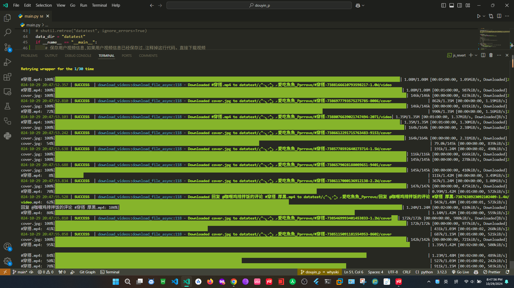

## 抖音视频爬虫

- 输入用户主页链接，获取用户发布的所有无水印视频，视频封面，背景音乐，点赞数，评论数，分享数，发布时间等信息
- 不是js逆向，而是利用playwright进入用户主页，hook接口获取数据，保存在`aweme.json`文件中🥲
- 然后利用python并发下载视频，音频，封面等文件，支持断点续传，一次下载上千个视频没问题
- 初次使用需要网页登录，因为不登录只能看到部分视频，无法获取全部视频信息
- 登录一次后，下次再次使用时，不需要再次登录并开启无头模式，因为登录信息会保存在本地`state.json`文件中

```python
# 数据保存目录
# 生成的目录结构如下:
# - f"data_dir"
# - - f"{username}_{douyin_number}"
# - - - aweme.json # 用户发布的所有视频信息obj列表
# - - - f"{视频描述}-{aweme_id}-{formatted_digg_count_str}"
# - - - - video # 视频文件
# - - - - mp3 # 背景音乐文件
# - - - - cover # 视频封面文件
# - - f"{username}_{douyin_number}"
# - - - aweme.json # 用户发布的所有视频信息obj列表
# - - - f"{视频描述}-{aweme_id}-{formatted_digg_count_str}"
# - - - - video
# - - - - mp3
# - - - - cover
# - - f"{username}_{douyin_number}"
# - - - aweme.json # 用户发布的所有视频信息obj列表
# - - - f"{视频描述}-{aweme_id}-{formatted_digg_count_str}"
# - - - - video
# - - - - mp3
# - - - - cover
-------------------------
```

### 使用方法

- 依赖安装
```bash
pip install rich playwright loguru requests aiohttp tqdm fake_useragent
playwright install
```
- 运行
```bash
python main.py
```

### 

